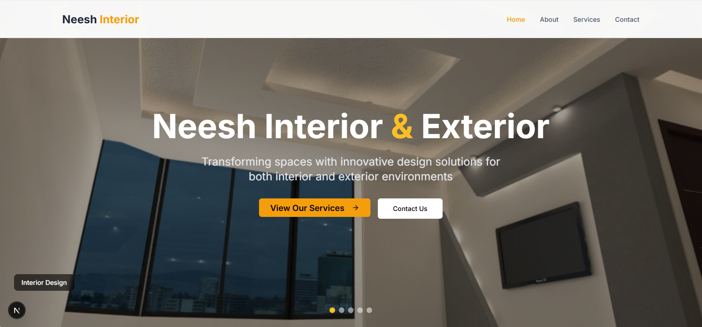
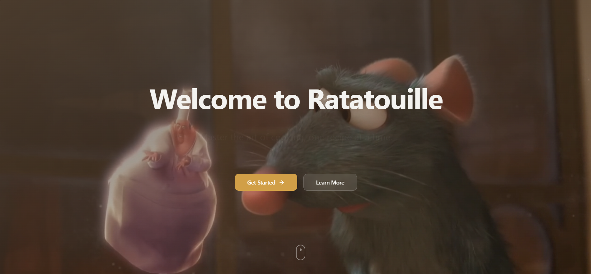

# 💫 Hi 👋, I'm SARAN:
Artificial Intelligence & Data Science Student passionate about solving real-world problems with intelligent systems   - 💼 Developed two production-level projects during internship and client work - 🍳 Built a hobby project: Ratatouille – AI-powered recipe generator - 🌱 Exploring advanced AI integration, web development, and cloud platforms - 🎨 Hobby: Drawing and creative design - 💬 “Life unfolds in its own way; the key is to accept, observe, and move with it.”  
# 🏆 Projects  
# 1️⃣ Component Management (Internship at Cavinkare)
 - Built to **digitize and manage component requests** in the engineering store   - Features:   - User login and request submission     - Department-wise admin approval/denial     - Request filtering with notes     - Admin dashboard with editing, visualization, and Excel download   - 
# Tech Stack:
         
# 2️⃣ Neesh Home Interior & Exterior (Client Project) 
 - Web platform for **interior/exterior engagement and operations management**   - Features:   - Admin panel with **hashed authentication** and database connectivity     - Request management with **pie/line chart visualizations**     - Responsive UI/UX for desktop and mobile   - Deployed live on **Vercel**, production-ready solution     
# Tech Stack:
           
# 3️⃣ Ratatouille (Hobby Project)
   - AI-powered recipe generator   - Features:   - **Text-based** or **image-based ingredient input**     - Generates recipes using **Gemini AI**     - Chat interface for interactive guidance     - Secure password hashing and history tracking   - 
# Tech Stack:
  
         

# 🌐 Socials:
   

# 💻 Tech Stack:
                 

